# Daily Reflection Tree — Visual Diagram

```mermaid
flowchart TD
    START([🌙 START\nGood evening...]) --> A1_OPEN

    subgraph AXIS1["── AXIS 1: Locus of Control ──"]
        direction TB
        A1_OPEN["❓ A1_OPEN\nOne word for today?\nRewarding · Productive · Challenging · Draining"]
        A1_D1{{"D1\nanswer-based"}}
        A1_Q2_POS["❓ A1_Q2_POS\nWhen things went well,\nwhat was the main reason?"]
        A1_Q2_NEG["❓ A1_Q2_NEG\nWhen things got hard,\nwhere did your mind go?"]
        A1_D2{{"D2\nsignal: axis1"}}
        A1_Q3_INT["❓ A1_Q3_INT\nWhen you held your ground —\nwhat did that look like?"]
        A1_Q3_EXT["❓ A1_Q3_EXT\nWas there anything,\neven small, still yours to decide?"]
        A1_D3{{"D3\nsignal: axis1"}}
        A1_R_INT["💡 A1_R_INT\nYou held the wheel today —\neven when the road got rough."]
        A1_R_EXT["💡 A1_R_EXT\nToday's weight pulled\nyour attention outward."]
        A1_R_MIX["💡 A1_R_MIX\nYou moved between\nagency and reaction."]

        A1_OPEN -->|Rewarding · Productive| A1_D1
        A1_OPEN -->|Challenging · Draining| A1_D1
        A1_D1 -->|Positive word| A1_Q2_POS
        A1_D1 -->|Negative word| A1_Q2_NEG
        A1_Q2_POS -->|"signal recorded"| A1_D2
        A1_Q2_NEG -->|"signal recorded"| A1_D2
        A1_D2 -->|internal > external| A1_Q3_INT
        A1_D2 -->|default| A1_Q3_EXT
        A1_Q3_INT -->|"signal recorded"| A1_D3
        A1_Q3_EXT -->|"signal recorded"| A1_D3
        A1_D3 -->|internal > external| A1_R_INT
        A1_D3 -->|external > internal| A1_R_EXT
        A1_D3 -->|tied / default| A1_R_MIX
    end

    BRIDGE_1_2["🌉 BRIDGE 1→2\nNow: not how you responded\n— but what you brought."]

    subgraph AXIS2["── AXIS 2: Contribution vs Entitlement ──"]
        direction TB
        A2_OPEN["❓ A2_OPEN\nEnergy orientation today?\nGive · Recognition · Helped · Tracked others"]
        A2_D1{{"D1\nsignal: axis2"}}
        A2_Q2_CONTRIB["❓ A2_Q2_CONTRIB\nYou came in to give.\nWhere did your energy go?"]
        A2_Q2_ENTITLE["❓ A2_Q2_ENTITLE\nWhat would 'fair'\nhave looked like today?"]
        A2_D2{{"D2\nsignal: axis2"}}
        A2_R_CONTRIB["💡 A2_R_CONTRIB\nYour energy moved outward.\nYou gave without balancing the ledger."]
        A2_R_ENTITLE["💡 A2_R_ENTITLE\nYou were watching\nthe ledger closely."]
        A2_R_MIX["💡 A2_R_MIX\nYou gave some\nand kept score some."]

        A2_OPEN -->|"signal recorded"| A2_D1
        A2_D1 -->|contribution > entitlement| A2_Q2_CONTRIB
        A2_D1 -->|default| A2_Q2_ENTITLE
        A2_Q2_CONTRIB -->|"signal recorded"| A2_D2
        A2_Q2_ENTITLE -->|"signal recorded"| A2_D2
        A2_D2 -->|contribution > entitlement| A2_R_CONTRIB
        A2_D2 -->|entitlement > contribution| A2_R_ENTITLE
        A2_D2 -->|tied / default| A2_R_MIX
    end

    BRIDGE_2_3["🌉 BRIDGE 2→3\nOne last lens:\nwho was in the room with you?"]

    subgraph AXIS3["── AXIS 3: Radius of Concern ──"]
        direction TB
        A3_OPEN["❓ A3_OPEN\nWhose experience comes to mind?\nMine · Team · Colleague · Customer"]
        A3_D1{{"D1\nsignal: axis3"}}
        A3_Q2_SELF["❓ A3_Q2_SELF\nDid anyone around you\nbreak through your focus?"]
        A3_Q2_ALTRO["❓ A3_Q2_ALTRO\nWhat made you tune\ninto others today?"]
        A3_D2{{"D2\nsignal: axis3"}}
        A3_Q3_SELF["❓ A3_Q3_SELF\nAnyone who needed\nsomething from you?"]
        A3_Q3_ALTRO["❓ A3_Q3_ALTRO\nDoes outward orientation\nsustain or cost you?"]
        A3_D3{{"D3\nsignal: axis3"}}
        A3_R_SELF["💡 A3_R_SELF\nToday was mostly\nyours to carry."]
        A3_R_ALTRO["💡 A3_R_ALTRO\nYour lens was wide —\nothers were in the frame."]
        A3_R_MIX["💡 A3_R_MIX\nYou moved between\nself and others."]

        A3_OPEN -->|"signal recorded"| A3_D1
        A3_D1 -->|self > altro| A3_Q2_SELF
        A3_D1 -->|default| A3_Q2_ALTRO
        A3_Q2_SELF -->|"signal recorded"| A3_D2
        A3_Q2_ALTRO -->|"signal recorded"| A3_D2
        A3_D2 -->|self > altro| A3_Q3_SELF
        A3_D2 -->|default| A3_Q3_ALTRO
        A3_Q3_SELF -->|"signal recorded"| A3_D3
        A3_Q3_ALTRO -->|"signal recorded"| A3_D3
        A3_D3 -->|altro > self| A3_R_ALTRO
        A3_D3 -->|self > altro| A3_R_SELF
        A3_D3 -->|tied / default| A3_R_MIX
    end

    SUMMARY["📋 SUMMARY\nHere's what today surfaced:\nAxis 1 · Axis 2 · Axis 3\n+ '{A1_OPEN.answer}'"]
    END(["✨ END\nRest well."])

    A1_R_INT --> BRIDGE_1_2
    A1_R_EXT --> BRIDGE_1_2
    A1_R_MIX --> BRIDGE_1_2
    BRIDGE_1_2 --> A2_OPEN

    A2_R_CONTRIB --> BRIDGE_2_3
    A2_R_ENTITLE --> BRIDGE_2_3
    A2_R_MIX --> BRIDGE_2_3
    BRIDGE_2_3 --> A3_OPEN

    A3_R_SELF --> SUMMARY
    A3_R_ALTRO --> SUMMARY
    A3_R_MIX --> SUMMARY
    SUMMARY --> END
```

---

## Node Legend

| Symbol | Type | Description |
|--------|------|-------------|
| 🌙 | `start` | Session opener — auto-advances |
| ❓ | `question` | Employee picks one fixed option; records signal |
| {{ }} | `decision` | Internal routing — invisible to employee |
| 💡 | `reflection` | Insight shown to employee; employee clicks Continue |
| 🌉 | `bridge` | Axis transition statement — auto-advances |
| 📋 | `summary` | End-of-session synthesis with interpolated text |
| ✨ | `end` | Session close |

## Routing Logic

**Answer-based decisions** (A1_D1): Route based on the text of the employee's answer at the named node.

**Signal-based decisions** (A1_D2, A1_D3, A2_D1, A2_D2, A3_D1, A3_D2, A3_D3): Route by comparing accumulated signal tallies for the axis. E.g., `axis1.internal > axis1.external` → internal path.

**Signals** accumulate on question options: selecting an option records `axis:pole += 1` in session state. Decision nodes read these tallies to route deterministically — no randomness, no LLM.

## Possible Paths

With 13 question nodes (4 options each), the tree has **4^13 = ~67 million** theoretically possible input combinations. Practically, the decision routing collapses these into **9 distinct reflection paths** (3 per axis × 3 axes), each producing a unique combination of reflections and a personalized summary.
